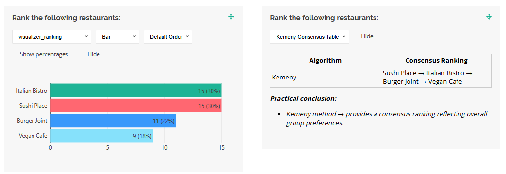

# Kemeny Rule

## Problem
When individuals rank options (e.g., restaurants, candidates, or dates) in order of preference, combining these rankings into a single consensus sequence that best reflects the group's preferences is challenging. The goal is to minimize conflicts between individual rankings and the final order, where a conflict occurs if the final order ranks option A above B, but an individual prefers B above A.

## Solution
The Kemeny Rule aggregates ranked votes to produce a single ordered sequence that minimizes the total number of conflicts with individual preferences. Key features:

- **Input**: Each participant ranks options from most to least preferred.
- **Process**: The algorithm evaluates all possible permutations of options to find the one that maximizes agreement with individual rankings.
- **Output**: A consensus ranking (e.g., A → B → C → D) that best represents the group's preferences.
- **Benefit**: The method prioritizes options ranked higher by more people, minimizing overall disagreement.

**Example**:
- Participant 1: A → B → C → D
- Participant 2: B → A → D → C
- Participant 3: A → C → B → D
- Kemeny Result: A → B → C → D (minimizes conflicts across all rankings).

### Code Sample
Below is a custom visualizer for SurveyJS to display the Kemeny consensus ranking.

```javascript
import {
  VisualizerBase,
  VisualizationManager,
  localization,
} from "survey-analytics";

// Works on small datasets (4-5 responses)
function computeKemenyRanking(data) {
  const venues = ["italian", "sushi", "burger", "vegan"];

  function allPermutations(arr) {
    if (arr.length <= 1) return [arr];
    const result = [];
    for (let i = 0; i < arr.length; i++) {
      const rest = arr.slice(0, i).concat(arr.slice(i + 1));
      allPermutations(rest).forEach((p) => result.push([arr[i], ...p]));
    }
    return result;
  }

  function pairwiseScore(permutation, ranking) {
    let score = 0;
    for (let i = 0; i < permutation.length; i++) {
      for (let j = i + 1; j < permutation.length; j++) {
        const a = permutation[i];
        const b = permutation[j];
        if (ranking.indexOf(a) < ranking.indexOf(b)) score += 1;
      }
    }
    return score;
  }

  const permutations = allPermutations(venues);
  let bestPerm = permutations[0];
  let bestScore = -1;

  permutations.forEach((p) => {
    let totalScore = 0;
    data.forEach((d) => {
      totalScore += pairwiseScore(p, d.venueRanking);
    });
    if (totalScore > bestScore) {
      bestScore = totalScore;
      bestPerm = p;
    }
  });

  return bestPerm;
}

function KemenyVisualizer(question, data, options) {
  function renderContent(container, visualizer) {
    container.style.width = "100%";

    const consensus = computeKemenyRanking(visualizer.surveyData);

    const html =
      `<div style="width:100%;">` +
      `<table style="border-collapse: collapse; width: 100%; table-layout: fixed;">` +
      `<thead>` +
      `<tr>` +
      `<th style="border:1px solid #ccc; padding:4px;">Algorithm</th>` +
      `<th style="border:1px solid #ccc; padding:4px;">Consensus Ranking</th>` +
      `</tr>` +
      `</thead>` +
      `<tbody>` +
      `<tr>` +
      `<td style="border:1px solid #ccc; padding:4px;">Kemeny</td>` +
      `<td style="border:1px solid #ccc; padding:4px;">` +
      consensus
        .map((v) => question.choices.find((c) => c.value === v)?.text || v)
        .join(" → ") +
      `</td>` +
      `</tr>` +
      `</tbody>` +
      `</table>` +
      `<div style="margin-top:1em; font-style:italic;">` +
      `<p><b>Practical conclusion:</b></p>` +
      `<ul>` +
      `<li>Kemeny method → provides a consensus ranking reflecting overall group preferences.</li>` +
      `</ul>` +
      `</div>` +
      `</div>`;

    container.innerHTML = html;
  }

  return new VisualizerBase(
    question,
    data,
    { renderContent },
    "kemeny-visualizer"
  );
}

VisualizationManager.registerVisualizer("ranking", KemenyVisualizer, 0);

localization.locales["en"]["visualizer_kemeny-visualizer"] =
  "Kemeny Consensus Table";
```

### Survey JSON Schema
This JSON schema defines a survey for ranking lunch venues.

```json
{
  "title": "Team Lunch Venue Ranking",
  "description": "Rank the lunch venues from most preferred to least preferred.",
  "pages": [
    {
      "name": "page1",
      "elements": [
        {
          "type": "ranking",
          "name": "venueRanking",
          "title": "Rank the following restaurants:",
          "isRequired": true,
          "choices": [
            { "value": "italian", "text": "Italian Bistro" },
            { "value": "sushi", "text": "Sushi Place" },
            { "value": "burger", "text": "Burger Joint" },
            { "value": "vegan", "text": "Vegan Cafe" }
          ]
        }
      ]
    }
  ]
}
```




## Learn More
- SurveyJS demos: [Implement a Custom Data Visualizer](https://surveyjs.io/dashboard/examples/custom-survey-data-visualizer/).
 - Learn about the Kemeny-Young method: [Kemeny-Young Method](https://en.wikipedia.org/wiki/Kemeny-Young_method)