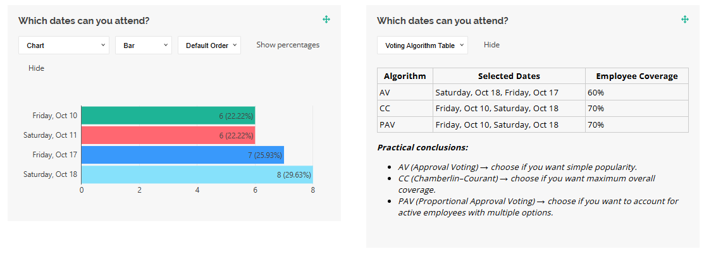

# Multiwinner Voting Example Using SurveyJS Dashboard

## Problem

When organizing an event like a company movie night, the venue may not accommodate all employees at once. The goal is to select multiple dates to maximize the number of employees who can attend at least one screening. Standard Approval Voting (AV) simply picks the most popular dates, but this may favor the same group of employees across all dates, leaving many unrepresented. For example, both chosen dates might suit only 40% of employees, with no additional people covered.

## Solution

Multiwinner Voting helps solve this problem by selecting dates that maximize unique employee coverage. The idea is to distribute available dates, so that more employees get a chance to attend at least one screening.

The process works as follows:

1. Organizers select possible dates.
2. Employees mark all dates they can attend (via checkbox ballots).
3. Dates are evaluated using one or more multiwinner voting algorithms:
   - Approval Voting (AV) - Selects the dates with the most total votes.
   - Chamberlin–Courant (CC) - Maximizes unique employee coverage.
   - Proportional Approval Voting (PAV) - Balances between overall coverage and rewarding employees who are flexible across multiple dates.
4. Organizers then choose the approach that best fits their goal:
   - AV for pure popularity.
   - CC for maximum unique coverage.
   - PAV to balance both.

To compute the results and visualize them, you can implement a custom data visualizer for SurveyJS Dashboard.



### Code Sample

#### Helper Functions

The following helper functions implement three voting algorithms: AV, CC, and PAV.

```javascript
// multiwinnerVotingHelper.js

// AV: Top k most approved dates
export function computeAV(data, k) {
  const counts = {};
  data.forEach((d) => {
    d.availableDates.forEach((v) => {
      counts[v] = (counts[v] || 0) + 1;
    });
  });
  return Object.entries(counts)
    .sort((a, b) => b[1] - a[1])
    .slice(0, k)
    .map((e) => e[0]);
}

// CC: Maximize coverage of unique employees
export function computeCC(data, k) {
  const candidates = Array.from(new Set(data.flatMap((d) => d.availableDates)));
  let bestSet = [];
  let maxCoverage = -1;

  // Generate all combinations of k dates
  function combinations(arr, k) {
    if (k === 0) return [[]];
    if (arr.length < k) return [];
    const [first, ...rest] = arr;
    const withFirst = combinations(rest, k - 1).map((c) => [first, ...c]);
    const withoutFirst = combinations(rest, k);
    return withFirst.concat(withoutFirst);
  }

  combinations(candidates, k).forEach((combo) => {
    const covered = new Set();
    data.forEach((d) => {
      if (d.availableDates.some((v) => combo.includes(v))) {
        covered.add(d);
      }
    });
    if (covered.size > maxCoverage) {
      maxCoverage = covered.size;
      bestSet = combo;
    }
  });

  return bestSet;
}

// PAV: Weighted approval voting
export function computePAV(data, k) {
  const candidates = Array.from(new Set(data.flatMap((d) => d.availableDates)));
  let bestSet = [];
  let maxScore = -1;

  function combinations(arr, k) {
    if (k === 0) return [[]];
    if (arr.length < k) return [];
    const [first, ...rest] = arr;
    const withFirst = combinations(rest, k - 1).map((c) => [first, ...c]);
    const withoutFirst = combinations(rest, k);
    return withFirst.concat(withoutFirst);
  }

  combinations(candidates, k).forEach((combo) => {
    let score = 0;
    data.forEach((d) => {
      const count = d.availableDates.filter((v) => combo.includes(v)).length;
      // add 1 + 1/2 + 1/3 ... for multiple covered dates
      for (let i = 1; i <= count; i++) {
        score += 1 / i;
      }
    });
    if (score > maxScore) {
      maxScore = score;
      bestSet = combo;
    }
  });

  return bestSet;
}
```

#### Custom Data Visualizer

This visualizer compares all three algorithms and displays selected dates with corresponding employee coverage.

```javascript
// votingAlgorithmVisualizer.js
import {
  VisualizerBase,
  VisualizationManager,
  localization,
} from "survey-analytics";
import { computeAV, computeCC, computePAV } from "./multiwinnerVotingHelper.js";

function VotingAlgorithmVisualizer(question, data, options) {
  function calculateCoverage(data) {
    const k = 2;
    const AV = computeAV(data, k);
    const CC = computeCC(data, k);
    const PAV = computePAV(data, k);
    const totalEmployees = data.length;

    function coveragePercent(selected) {
      const covered = new Set();
      data.forEach((d) => {
        if (d.availableDates.some((v) => selected.includes(v))) {
          covered.add(d);
        }
      });
      return Math.round((covered.size / totalEmployees) * 100);
    }

    return {
      coverage: { AV, CC, PAV },
      coveragePercent: {
        AV: coveragePercent(AV),
        CC: coveragePercent(CC),
        PAV: coveragePercent(PAV),
      },
    };
  }

  function renderContent(container, visualizer) {
    container.style.width = "100%";

    const { coverage, coveragePercent } = calculateCoverage(
      visualizer.surveyData
    );

    let html =
      `<div style="width:100%;">` +
      `<table style="border-collapse: collapse; width: 100%;">` +
      `<thead>` +
      `<tr>` +
      `<th style="border:1px solid #ccc; padding:4px;">Algorithm</th>` +
      `<th style="border:1px solid #ccc; padding:4px;">Selected Dates</th>` +
      `<th style="border:1px solid #ccc; padding:4px;">Employee Coverage</th>` +
      `</tr>` +
      `</thead>` +
      `<tbody>`;

    for (let alg in coverage) {
      const datesText = coverage[alg]
        .map((v) => question.choices.find((c) => c.value === v)?.text || v)
        .join(", ");

      html +=
        `<tr>` +
        `<td style="border:1px solid #ccc; padding:4px;">${alg}</td>` +
        `<td style="border:1px solid #ccc; padding:4px;">${datesText}</td>` +
        `<td style="border:1px solid #ccc; padding:4px;">${coveragePercent[alg]}%</td>` +
        `</tr>`;
    }

    html += `</tbody></table></div>`;

    html +=
      `<div style="margin-top:1em; font-style:italic;">` +
      `<p><b>Practical conclusions:</b></p>` +
      `<ul>` +
      `<li>AV (Approval Voting) → choose if you want simple popularity.</li>` +
      `<li>CC (Chamberlin–Courant) → choose if you want maximum overall coverage.</li>` +
      `<li>PAV (Proportional Approval Voting) → choose if you want to account for active employees with multiple options.</li>` +
      `</ul>` +
      `</div>`;

    container.innerHTML = html;
  }

  return new VisualizerBase(
    question,
    data,
    { renderContent },
    "voting-algorithm"
  );
}

VisualizationManager.registerVisualizer(
  "checkbox",
  VotingAlgorithmVisualizer,
  0
);

localization.locales["en"]["visualizer_voting-algorithm"] =
  "Voting Algorithm Table";
```

### Survey JSON Schema

Below is the survey JSON schema used in this example:

```json
{
  "title": "Movie Screening Date Voting",
  "description": "The company is organizing TWO movie screenings. Please select all dates you are available to attend.",
  "pages": [
    {
      "name": "page1",
      "elements": [
        {
          "type": "checkbox",
          "name": "availableDates",
          "title": "Which dates are you available to attend?",
          "isRequired": true,
          "choices": [
            { "value": "fri_10", "text": "Friday, Oct 10" },
            { "value": "sat_11", "text": "Saturday, Oct 11" },
            { "value": "fri_17", "text": "Friday, Oct 17" },
            { "value": "sat_18", "text": "Saturday, Oct 18" },
          ]
        }
      ]
    }
  ]
}
```

[Open in CodeSandbox](https://codesandbox.io/p/sandbox/surveyjs-dashboard-multiwinner-voting-example-forked-4pllmn)

## Learn More

- [Implement a Custom Data Visualizer](https://surveyjs.io/dashboard/examples/custom-survey-data-visualizer/)
- [Multiwinner Voting (Wikipedia)](https://en.wikipedia.org/wiki/Multiwinner_voting)