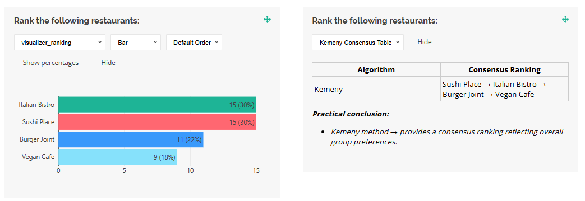

# Ranking Using the Kemeny Method in SurveyJS Dashboard

## Problem

When participants rank a set of options (for example, restaurants, candidates, or event dates), combining these rankings into a single group consensus can be difficult. The goal is to find an ordering that best reflects the collective preferences while minimizing disagreements. A disagreement (or conflict) occurs when the final ranking places option A above option B, but an individual prefers B over A.

## Solution

The Kemeny method (also known as the Kemeny-Young rule, VoteFair popularity ranking, or maximum likelihood method) produces a consensus ranking that minimizes the total number of pairwise conflicts with individual preferences. In essence, it finds the order that most participants can agree on.

The method works as follows:

1. Each participant ranks the available options from most to least preferred.
2. The algorithm evaluates all possible orderings and identifies the one with the fewest pairwise conflicts compared to all individual rankings.
3. The resulting sequence represents the group’s collective preference.

**Example**:

- Participant 1: A → B → C → D
- Participant 2: B → A → D → C
- Participant 3: A → C → B → D
- Kemeny result: A → B → C → D (minimizes conflicts across all rankings)

To calculate and display Kemeny results, you can implement a custom data visualizer for SurveyJS Dashboard.



### Code Sample

#### Helper Function

The following helper functions compute the consensus ranking using the Kemeny method:

```js
// kemenyRankingHelper.js
export function computeKemenyRanking(data) {
  const venues = ["italian", "sushi", "burger", "vegan"];

  function allPermutations(arr) {
    if (arr.length <= 1) return [arr];
    const result = [];
    for (let i = 0; i < arr.length; i++) {
      const rest = arr.slice(0, i).concat(arr.slice(i + 1));
      allPermutations(rest).forEach((p) => result.push([arr[i], ...p]));
    }
    return result;
  }

  function pairwiseScore(permutation, ranking) {
    let score = 0;
    for (let i = 0; i < permutation.length; i++) {
      for (let j = i + 1; j < permutation.length; j++) {
        const a = permutation[i];
        const b = permutation[j];
        if (ranking.indexOf(a) < ranking.indexOf(b)) score += 1;
      }
    }
    return score;
  }

  const permutations = allPermutations(venues);
  let bestPerm = permutations[0];
  let bestScore = -1;

  permutations.forEach((p) => {
    let totalScore = 0;
    data.forEach((d) => {
      totalScore += pairwiseScore(p, d.venueRanking);
    });
    if (totalScore > bestScore) {
      bestScore = totalScore;
      bestPerm = p;
    }
  });

  return bestPerm;
}
```


#### Custom Data Visualizer

This visualizer displays the consensus ranking computed by the Kemeny method.

```javascript
// kemenyRankingVisualizer.js
import {
  VisualizerBase,
  VisualizationManager,
  localization,
} from "survey-analytics";
import { computeKemenyRanking } from "./kemenyRankingHelper.js";

function KemenyVisualizer(question, data, options) {
  function renderContent(container, visualizer) {
    container.style.width = "100%";

    const consensus = computeKemenyRanking(visualizer.surveyData);

    const html =
      `<div style="width:100%;">` +
      `<table style="border-collapse: collapse; width: 100%; table-layout: fixed;">` +
      `<thead>` +
      `<tr>` +
      `<th style="border:1px solid #ccc; padding:4px;">Algorithm</th>` +
      `<th style="border:1px solid #ccc; padding:4px;">Consensus Ranking</th>` +
      `</tr>` +
      `</thead>` +
      `<tbody>` +
      `<tr>` +
      `<td style="border:1px solid #ccc; padding:4px;">Kemeny</td>` +
      `<td style="border:1px solid #ccc; padding:4px;">` +
      consensus
        .map((v) => question.choices.find((c) => c.value === v)?.text || v)
        .join(" → ") +
      `</td>` +
      `</tr>` +
      `</tbody>` +
      `</table>` +
      `<div style="margin-top:1em; font-style:italic;">` +
      `<p><b>Practical conclusion:</b></p>` +
      `<ul>` +
      `<li>Kemeny method → provides a consensus ranking reflecting overall group preferences.</li>` +
      `</ul>` +
      `</div>` +
      `</div>`;

    container.innerHTML = html;
  }

  return new VisualizerBase(
    question,
    data,
    { renderContent },
    "kemeny-visualizer"
  );
}

VisualizationManager.registerVisualizer("ranking", KemenyVisualizer, 0);

localization.locales["en"]["visualizer_kemeny-visualizer"] ="Kemeny Consensus Table";
localization.locales["en"]["visualizer_ranking"] = "Chart";
```

### Survey JSON Schema

Below is the survey JSON schema used in this example:

```json
{
  "title": "Team Lunch Venue Ranking",
  "description": "Rank the lunch venues from most preferred to least preferred.",
  "pages": [
    {
      "name": "page1",
      "elements": [
        {
          "type": "ranking",
          "name": "venueRanking",
          "title": "Rank the following restaurants:",
          "isRequired": true,
          "choices": [
            { "value": "italian", "text": "Italian Bistro" },
            { "value": "sushi", "text": "Sushi Place" },
            { "value": "burger", "text": "Burger Joint" },
            { "value": "vegan", "text": "Vegan Cafe" }
          ]
        }
      ]
    }
  ]
}
```

[Open in CodeSandbox](https://codesandbox.io/p/sandbox/surveyjs-dashboard-kemeny-method-ranking-43ncql)

## Learn More

- [Implement a Custom Data Visualizer](https://surveyjs.io/dashboard/examples/custom-survey-data-visualizer/).
- [Kemeny Method (Wikipedia)](https://en.wikipedia.org/wiki/Kemeny_method)